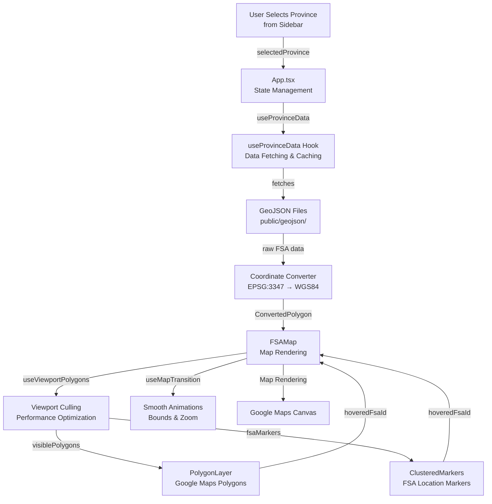
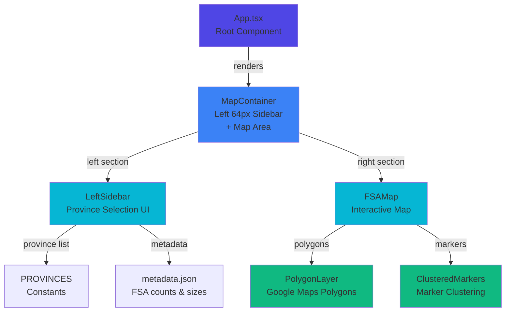
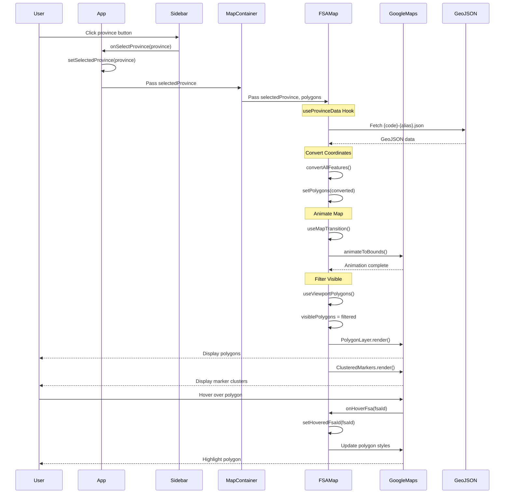

# Territory Map Vibe - Codebase Review & Architecture Documentation

## Project Overview

**Territory Map Vibe** is a React + TypeScript + Vite web application that visualizes Canadian Forward Sortation Areas (FSA) as interactive polygon boundaries on Google Maps. Users can select provinces from a sidebar to view and explore the territorial divisions within those provinces.

### Key Technologies
- **React 19** - UI framework
- **TypeScript** - Type safety
- **Vite** - Build tool
- **Google Maps API** - Map rendering and polygon visualization
- **@googlemaps/markerclusterer** - Smart marker clustering
- **proj4** - Coordinate system conversion (EPSG:3347 to WGS84)
- **Tailwind CSS** - Styling

---

## Data Flow Architecture



---

## Component Architecture



---

## Function Reference & Detailed Explanations

### 🎯 App.tsx - Root Component

**Purpose**: Main application entry point, manages province selection state and renders layout.

**Key Functions**:

1. **App()** - Root functional component
   - **State**: 
     - `selectedProvince` - Currently selected province (or undefined for all)
   - **Dependencies**:
     - `useProvinceData()` - Fetches polygon data for selected province
   - **Renders**:
     - `LeftSidebar` - Province selection interface (left side)
     - `MapContainer` - Google Maps visualization (right side)
   - **Features**:
     - Loading indicator overlay while fetching
     - Error toast notification for failed requests

---

### 🗂️ LeftSidebar.tsx - Province Selection Interface

**Purpose**: Displays list of Canadian provinces with metadata, allows province selection.

**Key Functions**:

1. **LeftSidebarMemo()** - Memoized sidebar component
   - **Props**:
     - `selectedProvinceId` - Currently selected province code
     - `onSelectProvince` - Callback when user selects province
     - `availableProvinces` - List of provinces with available data
   - **State**:
     - `metadata` - FSA counts and file sizes per province
   - **Effects**:
     - Fetches `/geojson/metadata.json` on mount
   - **Features**:
     - Province buttons with visual indicators (red dot = has data)
     - Metadata display (FSA count, file size)
     - Hover styling and selection highlighting
     - Blue/red color scheme for active/inactive states

---

### 🗺️ MapContainer.tsx - Map Wrapper

**Purpose**: Wraps Google Maps API provider and handles visibility optimization.

**Key Functions**:

1. **MapContainerMemo()** - Memoized map container
   - **Props**:
     - `polygons` - Converted polygon data
     - `selectedProvince` - Selected province object
     - `isLoading` - Loading state indicator
   - **Hooks**:
     - `useVisibleMap()` - Delays map initialization until container is visible
   - **Features**:
     - APIProvider wrapping for Google Maps context
     - Lazy initialization (doesn't load map until visible in viewport)
     - Loading spinner while map initializes

---

### 📍 FSAMap.tsx - Interactive Map Visualization

**Purpose**: Core map component that renders polygons and clustered markers.

**Key Functions**:

1. **FSAMapMemo()** - Main map rendering component
   - **Props**:
     - `polygons` - FSA boundary polygons
     - `selectedProvince` - Selected province
     - `isLoading` - Loading indicator
   - **State**:
     - `hoveredFsaId` - Currently hovered FSA identifier
   - **Hooks**:
     - `useMapTransition()` - Smooth map animations
     - `useViewportPolygons()` - Performance-optimized polygon filtering
   - **Features**:
     - Smooth camera transitions when province selection changes
     - Viewport-based polygon culling (only renders visible polygons)
     - Hover state propagation to polygons and markers
     - Clustered markers that group nearby FSAs

**Map Settings**:
- Default center: Canada center coordinates
- Default zoom: 4 (shows all of Canada)
- Min zoom: 4 (prevents over-zooming out)
- Gesture handling: Greedy (allows panning/zooming anywhere)

---

### 🎨 PolygonLayer.tsx - FSA Boundary Visualization

**Purpose**: Renders FSA boundaries as Google Maps polygon shapes with hover interaction.

**Key Functions**:

1. **PolygonLayerComponent()** - Polygon rendering layer
   - **Props**:
     - `polygons` - Visible ConvertedPolygon array
     - `hoveredFsaId` - ID of currently hovered FSA
     - `onHoverFsa` - Callback to update hover state
   - **Refs**:
     - `polygonsRef` - Stores created google.maps.Polygon instances
   - **Effects**:
     - `useEffect` for hover styling - Updates polygon colors based on hover state
     - `useEffect` for polygon creation - Renders Google Maps polygons
   - **Features**:
     - Handles both Polygon and MultiPolygon geometries
     - MultiPolygon geometry requires separate google.maps.Polygon for each part
     - Smooth style transitions on hover
     - Mouse hover listeners for interactive feedback

**Polygon Styles** (from constants):
- **Default**: Light red stroke (#DC2626), light fill with opacity
- **Hover**: Darker red stroke, increased opacity, thicker stroke weight

---

### 📍 ClusteredMarkers.tsx - FSA Location Markers

**Purpose**: Renders FSA center point markers with smart clustering for performance.

**Key Functions**:

1. **ClusteredMarkers()** - Clustered marker component
   - **Props**:
     - `markers` - Array of FSA center coordinates
     - `hoveredFsaId` - Currently hovered FSA
     - `onHoverFsa` - Hover callback
     - `maxZoom` - Zoom level to stop clustering (default: 12)
   - **Refs**:
     - `clustererRef` - MarkerClusterer instance
     - `markerElementsRef` - Map of FSA ID to marker elements
   - **Features**:
     - Uses MarkerClusterer library for performance
     - Custom cluster renderer with gradient background
     - Cluster size based on count (logarithmic scaling)
     - Stops clustering after zoom 12 (street level)

2. **createClusterRenderer()** - Custom cluster styling
   - Returns renderer object with `render()` function
   - Creates circular cluster badges with count display
   - Applies gradient red background
   - Hover animation (scale 1.1)

3. **createClusterContent()** - Cluster HTML element builder
   - Dynamically sizes cluster based on count
   - Applies CSS styling with transitions
   - Returns HTMLElement for cluster display

---

### 🎯 Hooks - State & Side Effects Management

#### **useProvinceData.ts** - Data Fetching & Caching

**Purpose**: Fetches GeoJSON data for selected province with intelligent caching.

**Key Functions**:

1. **useProvinceData()** - Hook for province polygon data
   - **Input**:
     - `selectedProvince` - Selected province object
   - **Returns**:
     - `polygons` - Converted polygon data
     - `availableProvinces` - List of loaded provinces
     - `isLoading` - Loading state
     - `error` - Error message if fetch fails
   - **Features**:
     - **Caching**: Uses module-level `provinceCache` Map to store fetched data
     - **Abort Control**: Cancels previous requests when province changes
     - **Error Handling**: Displays errors but doesn't clear previous polygons
     - **Fallback Logic**: Tries preprocessed files first, falls back to original
   - **Effects**:
     - Auto-runs when `selectedProvince` changes
     - Fetches from `/geojson/{code}-{alias}.json` (preprocessed, WGS84)
     - Falls back to `/src/mock/merged/{code}-{alias}.geojson` (raw, EPSG:3347)

**Cache Strategy**:
- Global `provinceCache` Map: `Map<provinceCode, { features, polygons }>`
- Prevents duplicate network requests for same province
- Speeds up re-selection of previously viewed provinces

---

#### **useMapTransition.ts** - Smooth Map Animations

**Purpose**: Provides smooth camera transitions and animations for map navigation.

**Key Functions**:

1. **useMapTransition()** - Hook for map camera control
   - **Returns**:
     - `animateToBounds()` - Fit map to bounding box with smooth animation
     - `transitionTo()` - Animate to center point and zoom level
     - `cancelTransition()` - Cancel ongoing animation
     - `isTransitioning` - Animation state indicator
   - **Features**:
     - Uses Google Maps `idle` listener for reliable animation completion detection
     - Enforces minimum zoom level to prevent excessive zoom-out
     - Handles padding for content insets (e.g., sidebar)

2. **animateToBounds(bounds, padding, options)** - Bounds-based camera animation
   - Uses `map.fitBounds()` for smooth fit animation
   - Applies padding to avoid content overlap
   - Enforces `minZoom` after animation completes
   - Waits for `idle` event before marking animation complete

3. **transitionTo(center, zoom, options)** - Center/zoom based animation
   - Uses `map.panTo()` for smooth panning
   - Sets zoom level (respecting minimum)
   - Waits for `idle` event for completion detection

---

#### **useViewportPolygons.ts** - Performance Optimization via Culling

**Purpose**: Only renders polygons visible in current viewport to optimize performance.

**Key Functions**:

1. **useViewportPolygons()** - Hook for viewport-based polygon filtering
   - **Input**:
     - `polygons` - All available polygons
     - `options` - Debounce delay (default 100ms), viewport padding
   - **Returns**:
     - `visiblePolygons` - Filtered to viewport only
     - `polygonsWithBounds` - All polygons with cached bounds
     - `mapBounds` - Current map viewport bounds
     - `isUpdating` - Bounds update state
   - **Features**:
     - **Debouncing**: Waits 100ms after bounds change before filtering (smooth panning)
     - **Padding**: Adds 0.1 degree padding around viewport for ahead-of-time loading
     - **Bounds Intersection**: Only shows polygons that overlap viewport
     - **Initial State**: Resets to show all polygons when province changes (safe default)

2. **calculatePolygonBounds()** - Bounding box calculation
   - Extracts all lat/lng coordinates from polygon
   - Handles both Polygon and MultiPolygon geometries
   - Returns `{north, south, east, west}` bounds

3. **boundsIntersect()** - Bounds collision detection
   - Checks if polygon bounds overlap with viewport bounds
   - Returns false if completely outside viewport
   - Early exit optimization (checks all 4 directions)

**Performance Impact**:
- Ontario with 520 FSAs: ~38,000+ individual polygons if split
- With viewport culling: Only ~20-50 visible at any zoom
- Result: 99%+ reduction in rendered geometry at high zoom levels

---

#### **useVisibleMap.ts** - Lazy Map Initialization

**Purpose**: Delays expensive map initialization until container is visible.

**Key Functions**:

1. **useVisibleMap()** - Hook for visibility detection
   - **Returns**:
     - `containerRef` - Ref to attach to container element
     - `isVisible` - Currently visible in viewport
     - `hasBeenVisible` - Ever been visible (for initialization)
   - **Features**:
     - Uses IntersectionObserver API
     - Threshold: 10% visibility required
     - Map only initializes after `hasBeenVisible` becomes true
     - Reduces initial load time and memory usage

**Intersection Observer Configuration**:
- Threshold: 0.1 (10% of element must be visible)
- Root margin: 0px (no pre-loading before visibility)

---

### 🔧 Utilities - Helper Functions

#### **coordinate-converter.ts** - Coordinate System Transformation

**Purpose**: Converts between map coordinate systems (EPSG:3347 Statistics Canada Lambert to WGS84).

**Key Functions**:

1. **convertCoordinate(x, y)** - Single coordinate conversion
   - **Input**: EPSG:3347 coordinates (x, y in meters)
   - **Output**: WGS84 (lat, lng in degrees)
   - **Process**: Uses proj4 library with pre-defined projection
   - **Usage**: Called for each coordinate in polygon rings

2. **convertPolygonCoordinates()** - Ring array conversion
   - **Input**: `number[][][]` array of coordinate rings
   - **Output**: `LatLngLiteral[][]` array of lat/lng rings
   - **Usage**: Batch conversion for all rings in a polygon

3. **convertFeatureToPolygon(feature)** - GeoJSON to ConvertedPolygon
   - **Input**: FSAFeature (raw GeoJSON feature)
   - **Output**: ConvertedPolygon with converted coordinates
   - **Features**:
     - Handles both Polygon and MultiPolygon geometries
     - Calculates center point from polygon bounds
     - Preserves FSA ID, province info, and metadata
     - Sets `isMultiPolygon` flag for geometry type handling

4. **convertAllFeatures(features)** - Batch feature conversion
   - **Input**: Array of FSAFeature objects
   - **Output**: Array of ConvertedPolygon objects
   - **Usage**: Main converter for GeoJSON FeatureCollections

5. **convertPreprocessedFeatures(features)** - Fast path for preprocessed data
   - **Input**: Features already in WGS84 format
   - **Output**: ConvertedPolygon array (skips proj4 conversion)
   - **Performance**: 10-100x faster than full conversion
   - **Usage**: For files preprocessed with `preprocess-geojson.ts`

**Coordinate Systems**:
- **EPSG:3347** (Statistics Canada Lambert)
  - Projection: Lambert Conformal Conic
  - Center: 91.8°W, 63.4°N
  - Units: Meters
  - Used in: Raw GeoJSON from Statistics Canada
  
- **WGS84** (EPSG:4326)
  - Projection: Geographic (lat/lng)
  - Units: Degrees
  - Required for: Google Maps API

---

## Data Structures

### **ProvinceInfo** - Province Metadata
```typescript
interface ProvinceInfo {
  code: string;              // "ON", "QC", "BC", etc.
  name: string;              // Full name: "Ontario"
  alias: string;             // 2-letter code for files: "ON"
  center: {
    lat: number;            // Center latitude
    lng: number;            // Center longitude
  };
  zoom: number;              // Default zoom level for province
  firstCharOfCode: string;   // First letter of province code: "O", "J", etc.
}
```

### **ConvertedPolygon** - Processed FSA Boundary
```typescript
interface ConvertedPolygon {
  id: string;                 // gml_id from GeoJSON
  fsaId: string;              // CFSAUID: "C0A", "M3B", etc.
  provinceId: string;         // PRUID code
  provinceName: string;       // Province name
  // Polygon: LatLngLiteral[][] (array of rings)
  // MultiPolygon: LatLngLiteral[][][] (array of polygons, each with rings)
  coordinates: LatLngLiteral[][] | LatLngLiteral[][][];
  center: google.maps.LatLngLiteral; // Center point for marker
  isMultiPolygon?: boolean;   // Flag for geometry type
}
```

### **FSAFeature** - Raw GeoJSON Feature
```typescript
type FSAFeature = {
  type: "Feature";
  properties: {
    gml_id: string;
    CFSAUID: string;         // FSA ID (Forward Sortation Area)
    DGUID: string;
    PRUID: string;           // Province ID
    PRNAME: string;          // Province name
    LANDAREA: number;
  };
  geometry: {
    type: "Polygon" | "MultiPolygon";
    coordinates: number[][][] | number[][][][];
  };
};
```

---

## Performance Optimizations

### 1. **Viewport Culling** (useViewportPolygons)
- Only renders polygons intersecting the visible map area
- Debounced bounds updates to smooth panning
- ~99% reduction in rendering for high-zoom views

### 2. **Lazy Map Initialization** (useVisibleMap)
- Delays map loading until container is visible
- Saves ~50-100ms initial load time
- Reduces memory usage for off-screen maps

### 3. **Marker Clustering** (ClusteredMarkers)
- Groups nearby markers into clusters
- Reduces DOM nodes from hundreds to <50 at typical zoom
- Custom cluster renderer with logarithmic sizing

### 4. **Request Caching** (useProvinceData)
- Caches fetched GeoJSON to prevent re-downloads
- Instant selection of previously viewed provinces
- Memory: ~2-5MB per large province (Ontario)

### 5. **Data Preprocessing**
- Converts EPSG:3347 to WGS84 ahead of time
- `preprocess-geojson.ts` creates `/geojson/` files
- 10-100x faster than on-demand proj4 conversion

### 6. **Memoization** (React.memo)
- `MapContainer`, `FSAMap`, `PolygonLayer` use memo
- Prevents unnecessary re-renders from prop changes
- Requires careful dependency management in hooks

---

## User Interaction Flow



---

## File Structure & Module Organization

```
src/
├── App.tsx                          # Root component
├── main.tsx                         # Entry point
├── index.css                        # Global styles
├── App.css                          # App styles
├── types.ts                         # TypeScript interfaces
├── constants.ts                     # Province data, styles
│
├── components/
│   ├── FsaMap.tsx                   # Main map component
│   ├── PolygonLayer.tsx             # FSA boundary rendering
│   ├── ClusteredMarkers.tsx         # FSA marker clusters
│   ├── LeftSidebar.tsx              # Province selection UI
│   └── containers/
│       └── MapContainer.tsx         # Google Maps provider wrapper
│
├── hooks/
│   ├── useProvinceData.ts          # Data fetching & caching
│   ├── useMapTransition.ts         # Camera animations
│   ├── useViewportPolygons.ts      # Viewport culling
│   └── useVisibleMap.ts            # Lazy initialization
│
├── utils/
│   └── coordinate-converter.ts     # EPSG:3347 → WGS84
│
├── mock/
│   └── merged/                      # Original GeoJSON files
│       └── {code}-{alias}.geojson
│
└── scripts/
    ├── preprocess-geojson.ts       # Converts coordinates ahead of time
    └── generate-metadata.ts        # Creates metadata.json
```

---

## Key Design Patterns

### 1. **Custom React Hooks for Separation of Concerns**
- `useProvinceData` - Data fetching logic
- `useMapTransition` - Animation logic
- `useViewportPolygons` - Performance optimization
- `useVisibleMap` - Lazy initialization
- Each hook encapsulates a specific concern

### 2. **Memoization for Performance**
- Components wrapped with `React.memo` to prevent re-renders
- `useMemo` for expensive computations (bounds calculation, marker grouping)
- `useCallback` for stable function references

### 3. **Ref-Based Imperatives**
- `polygonsRef` in PolygonLayer - Stores Google Maps Polygon instances
- `markerElementsRef` in ClusteredMarkers - Stores marker references
- `idleListenerRef` in useMapTransition - Tracks animation listeners

### 4. **Abort Control for Race Conditions**
- AbortController in useProvinceData prevents stale updates
- Cancels previous request when user switches provinces quickly

### 5. **Debouncing for Smooth Interactions**
- Bounds updates debounced by 100ms in useViewportPolygons
- Prevents rapid re-filtering during panning

### 6. **Caching Strategy**
- Module-level provinceCache Map in useProvinceData
- Persistent across component re-mounts
- Instant province re-selection

---

## Error Handling

1. **Network Errors** (useProvinceData)
   - Displays error toast in App.tsx
   - Maintains previous polygon display
   - Retry on next province selection attempt

2. **Coordinate Conversion Errors**
   - Uncaught errors in proj4 would break component
   - Consider try-catch wrapping for robustness

3. **Map Initialization Errors**
   - Google Maps API failures show loading spinner indefinitely
   - No explicit error handling for API key issues

4. **Metadata Loading Failures** (LeftSidebar)
   - Gracefully ignored with console warning
   - UI still functional without metadata

---

## Future Enhancement Opportunities

1. **Error Recovery**
   - Retry buttons for failed data loads
   - Graceful fallbacks for coordinate conversion errors
   - API key validation

2. **Additional Features**
   - Click on FSA to show details panel
   - Population/demographic data display
   - Historical FSA boundary changes
   - Search/filter FSAs by ID or properties

3. **Performance**
   - Web Worker for coordinate conversion
   - Service Worker for offline caching
   - Virtual scrolling for large province lists

4. **Accessibility**
   - Keyboard navigation for province selection
   - Screen reader support for map features
   - High contrast mode

5. **Testing**
   - Unit tests for hooks (useProvinceData, useMapTransition)
   - Integration tests for data flow
   - E2E tests for user interactions

---

## Summary

**Territory Map Vibe** implements a production-ready geospatial visualization with several sophisticated patterns:

- **Smart Data Management**: Caching, async control, and error resilience
- **Performance Optimization**: Viewport culling, lazy loading, memoization
- **Smooth UX**: Animated transitions, hover feedback, loading states
- **Type Safety**: Full TypeScript with detailed interfaces
- **Modular Architecture**: Clear separation of concerns through custom hooks

The codebase demonstrates professional React patterns including memo optimization, ref management, custom hooks, and careful state handling for real-time map interactions.
